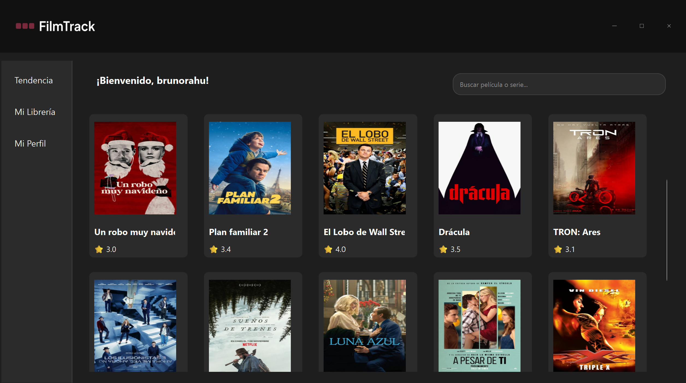

# 🎬 FilmTrack - Gestor de Películas y Series Inteligente

**FilmTrack** es una aplicación híbrida (Web y Escritorio) desarrollada como proyecto final de ingeniería. Su objetivo es centralizar la experiencia de seguimiento de cine, permitiendo a los usuarios gestionar su librería personal, interactuar socialmente con amigos y recibir recomendaciones personalizadas mediante un motor de Inteligencia Artificial.



## 🚀 Características Principales

* **Arquitectura Híbrida:** Cliente Web moderno (Reflex) y Cliente de Escritorio nativo de alto rendimiento (PySide6) sincronizados en tiempo real.
* **Backend Dockerizado:** API REST (Flask) y Base de Datos (SQL Server) orquestados mediante contenedores Docker para máxima portabilidad.
* **Inteligencia Artificial:** Sistema de recomendación *Content-Based Filtering* utilizando Scikit-Learn. Analiza tus gustos históricos para sugerirte contenido matemáticamente afín.
* **Módulo Social:**
    * Feed de actividad en tiempo real (reseñas y calificaciones de amigos).
    * Sistema de seguidores (Follow/Unfollow).
    * Búsqueda de usuarios.
* **Gestión de Librería Avanzada:**
    * Clasificación por estados: "Visto" (Completed) y "Por ver" (Watchlist).
    * Reseñas y calificaciones (1-5 estrellas).
    * Filtros inteligentes y búsqueda local.

---

## 🛠️ Pre-requisitos del Sistema

Para desplegar este proyecto, necesitas tener instalado:

1.  **Docker Desktop** (Debe estar ejecutándose).
2.  **Python 3.11** o superior.
3.  **Git**.

---

## ⚙️ Instalación y Despliegue

### 1. Clonar el Repositorio
Descarga el código fuente en tu máquina local:
```bash
git clone [https://github.com/TU_USUARIO/FilmTrack-Project.git](https://github.com/TU_USUARIO/FilmTrack-Project.git)
cd FilmTrack
```
### 2. Desplegar Backend y Base de Datos (Docker)
Este comando construirá la imagen del Backend e iniciará los servicios de API y Base de Datos SQL Server.

```bash
docker-compose up --build
```

Espera unos minutos hasta ver en la consola que el servidor está corriendo en 
```bash
http://0.0.0.0:5000.
```
### 3. Inicialización de la Base de Datos
Conéctate a tu instancia local de SQL Server utilizando cualquier cliente (SSMS, Azure Data Studio, DBeaver):

- **Servidor:** localhost, 1433
- **Usuario:** sa
- **Contraseña:** fuqtix-humke6-cukjYx

**Ejecuta los scripts SQL en el siguiente orden estricto:**

1. Creación de la BD.sql
2. SPs Básicos (Scripts de Login, Registro y Librería).
3. Social_Procedures.sql (Lógica social).
4. Mod_Procedure_RnR.sql (Lógica de reseñas).
5. Mock_Data_Injection.sql (Opcional: Carga usuarios y películas de prueba para demostración).

## 🖥️ Ejecución de Clientes

Se recomienda crear un entorno virtual para instalar las dependencias de los clientes y no afectar tu sistema principal.

```bash
# 1. Crear entorno virtual
python -m venv venv

# 2. Activar entorno (Windows)
.\venv\Scripts\activate

# 3. Instalar dependencias
pip install -r backend/requirements.txt 
pip install reflex PySide6
```

**Opción A: Cliente Web (Reflex)**
Interfaz moderna con Dashboard, Social y Recomendaciones AI.
```bash
cd web_client
reflex run
```

La aplicación se compilará y abrirá automáticamente en: http://localhost:3000

**Opción B: Cliente de Escritorio (PySide6)**
Interfaz nativa de alto rendimiento enfocada en la gestión local.
```bash
cd desktop_client
python main_desktop.py
```

---

## 🧪 Credenciales de Prueba (Demo)

Si utilizaste el script de inyección de datos proporcionado, puedes probar el sistema con las siguientes credenciales predeterminadas:

* **Usuario Principal:** `brunorahu`
* **Contraseña:** `password123`

**Usuarios para probar la interacción social:**
* Usuario: `Cinephile99` / Pass: `password123`
* Usuario: `HorrorQueen` / Pass: `password123`

---

## 📂 Estructura del Proyecto

La organización del código sigue una arquitectura modular:

* **/backend**: Contiene la API Flask, Lógica de Negocio, Modelos de Machine Learning y los DAOs de conexión a datos.
* **/web_client**: Código fuente del frontend reactivo desarrollado con Reflex.
* **/desktop_client**: Código fuente de la aplicación de escritorio (Qt/Python).
* **docker-compose.yml**: Archivo de orquestación de servicios y configuración de volúmenes persistentes.

---

## 👥 Autores

* **Bruno Gael Ramos Huerta**
* **Diego Flores Prudente**
* **Alejandra Bustos Sánchez**

*Universidad Iberoamericana León - Ingeniería en Inteligencia Artificial*